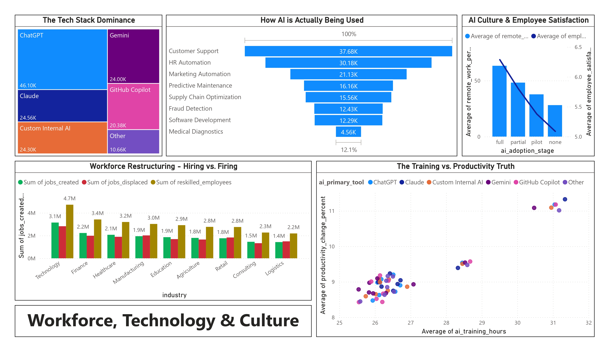

# Global AI Tools Adoption & Workforce Impact Analytics


## Project Overview
As artificial intelligence rapidly transforms the global economy, organizations struggle to track its tangible return on investment (ROI) and human impact. This project is an end-to-end Business Intelligence solution that analyzes corporate records to track AI adoption from macroeconomic global trends down to granular workforce shifts. 
It also includes scenario-based data refreshes (updated company, industry, and country inputs) to test how KPI trends change under new assumptions.

This interactive dashboard is designed to answer critical business questions:
* Which industries are seeing the highest revenue growth from AI?
* Is AI displacing more jobs than it creates?
* Does investing in employee AI training actually yield higher productivity?
* Which specific AI tools (e.g., ChatGPT, proprietary models) are dominating the enterprise space?

## Dashboard Previews
### The Macro View (Global & Executive Insights)

*Features a global choropleth map correlating digital maturity indices with national AI adoption rates, tracking total AI patent filings, and mapping the financial ROI.*

### The Micro View (Workforce & Technology)

*Introduces a custom **Net Job Impact** calculation, visualizes the correlation between employee training hours and productivity, and highlights AI tool dominance.*

## Key Features & Insights
The project features a comprehensive, two-page Power BI dashboard:

* **The Macro View (Global & Executive Insights):**
  * Features a global choropleth map correlating digital maturity indices with national AI adoption rates.
  * Tracks total AI patent filings and maps the financial ROI (revenue growth) of AI adoption across sectors using refreshed country and industry indicators.
* **The Micro View (Workforce & Technology):**
  * Introduces a custom **Net Job Impact** calculation, directly comparing roles created vs. roles displaced by automation.
  * Visualizes the correlation between employee training hours and productivity surges, including updated technology-sector growth assumptions.
  * Highlights AI tool dominance via an interactive treemap and analyzes top enterprise use-cases.
  * Supports side-by-side analysis with updated source files and a regenerated cleaned master dataset.

## Repository Structure

```text
├── project_report                 # Detailed analytical report and methodology (PDF)
├── ai_company_adoption.csv.gz     # Compressed main dataset 
├── ai_industry_summary.csv        # Industry-level aggregations
├── country_ai_index.csv           # Global macro indicators
├── ai_company_adoption_updated.csv.gz  # Updated company-level dataset
├── ai_industry_summary_updated.csv     # Updated industry-level dataset
├── country_ai_index_updated.csv        # Updated country-level indicators
├── ai_adoption_master_cleaned_updated.csv # Updated final merged dataset
├── dashboard.pbix                 # The Power BI Dashboard file (.pbix)                     
├── data_cleaning.ipynb            # Python scripts for data preprocessing
└── README.md                      # Project documentation
```
## Tech Stack & Methodology
* Data Engineering (Python): Utilized pandas in Jupyter Notebooks to ingest, clean, and standardize datasets.

* Data Modeling (Power BI): Engineered a relational data model connecting fact tables (company adoption data) with dimension tables (country indices and industry summaries).

* Analytics (DAX): Wrote custom Data Analysis Expressions to calculate dynamic KPIs, such as real-time workforce impact and productivity averages.

* Visualization: Designed a high-contrast, modern UI with interactive cross-filtering capabilities, allowing users to drill down by region, industry, or company size.

## How to Use
1. Clone the repository:
```bash
git clone [https://github.com/ardhigagan/ai-adoption-tracker.git](https://github.com/ardhigagan/ai-adoption-tracker.git)
```
2. Explore the Data Processing: Navigate to the data_cleaning.ipynb to view the Python preprocessing logic.
3. View the Dashboard: Open the .pbix file using Power BI Desktop.
4. Interact: Use the slicers on the dashboard to filter the global data by Region or Company Size.

## Author
ARKABRATA ROY, 2305284
